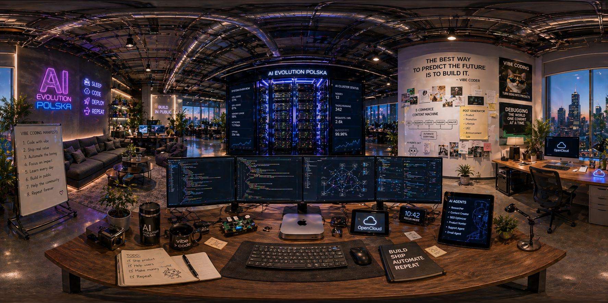

# 🌐 VirtualWorld 360

**Created by [AI Evolution Polska](https://aievolutionpolska.pl)**

[](https://github.com/aievolutionpl/VirtualWorld360)
[](LICENSE)
[](https://nodejs.org/)
[](https://openai.com/)
[](https://aievolutionpolska.pl)

> Immersive AI-powered 360° virtual world platform. Generate, explore and share stunning panoramic environments in seconds.



---

## 🇬🇧 English

### What is VirtualWorld 360?

VirtualWorld 360 is an open-source platform for generating and exploring immersive 360° panoramic environments using AI. Powered by OpenAI's `gpt-image-2` model and Three.js, it lets you create stunning virtual worlds from text prompts or reference images — no 3D skills required.

### ✨ Features

- **AI World Generator** — Create 360° panoramas from text prompts using `gpt-image-2`
- **Reference Image Support** — Upload up to 4 reference photos to guide generation
- **30+ World Templates** — Sci-Fi, Nature, Architecture, Fantasy, Business, Abstract categories
- **10 Built-in Environments** — Including AI Evolution HQ, Tokyo Neon, Arctic Aurora, Royal Palace and more
- **Immersive 360° Viewer** — Three.js-powered spherical viewer with mouse/touch/keyboard controls
- **Interactive Hotspots** — Clickable points of interest in each environment
- **Auto-Tour Mode** — Automatically cycles through all environments
- **Environment Controls** — Real-time brightness, contrast, saturation, FOV adjustments
- **Bilingual UI** — English and Polish language support (EN/PL toggle)
- **Screenshot Export** — Save current view as PNG
- **Generation History** — Gallery of all AI-generated worlds with delete support
- **REST API** — Node.js backend server for image generation and storage

### 🚀 Quick Start

**Prerequisites:** [Node.js](https://nodejs.org/) 18+, OpenAI API key

```bash
# 1. Clone the repository
git clone https://github.com/aievolutionpl/VirtualWorld360.git
cd VirtualWorld360

# 2. Install dependencies
npm install

# 3. Configure environment
cp .env.example .env
# Edit .env and add your OPENAI_API_KEY

# 4. Start the API server
node api-server.js

# 5. Open index.html in a browser (or use a local server)
# The API server runs on http://localhost:3001
```

### 🗂 Project Structure

```
VirtualWorld360/
├── index.html          # Main dashboard
├── generator.html      # AI world generator
├── viewer360.html      # 360° panoramic viewer
├── api-server.js       # Node.js REST API (OpenAI integration)
├── assets/
│   ├── styles.css      # Design system & UI tokens
│   ├── i18n.js         # EN/PL bilingual module
│   ├── templates.js    # World template library
│   ├── api-client.js   # Frontend API client
│   └── motion.js       # Animations & micro-interactions
├── generated/          # AI-generated images (auto-created)
├── env-*.jpg           # Built-in environment panoramas
└── .env.example        # Environment variables template
```

### 🌍 Built-in Environments

| Environment | Category | Description |
|---|---|---|
| 🖥️ AI Evolution HQ | Business | AI company headquarters |
| ⚡ Quantum Server | Sci-Fi | Futuristic data center |
| 🎨 Creative Studio | Business | Modern design studio |
| 💼 Executive Boardroom | Business | Luxury conference room |
| 🛸 LEO Orbit | Sci-Fi | Space station interior |
| 🗼 Tokyo Neon Rooftop | Sci-Fi | Cyberpunk Tokyo at night |
| 🌴 Jungle Temple | Nature | Ancient ruins in rainforest |
| ❄️ Arctic Aurora Station | Nature | Northern lights research base |
| 👑 Royal Palace Hall | Architecture | Grand baroque palace |
| 🌴 Vaporwave Neon Grid | Abstract | Synthwave dimension |

### ⚙️ API Reference

The backend (`api-server.js`) exposes:

| Method | Endpoint | Description |
|---|---|---|
| `POST` | `/api/generate` | Generate 360° image from prompt |
| `POST` | `/api/generate-with-reference` | Generate with reference images |
| `GET` | `/api/list` | List all generated images |
| `GET` | `/api/stats` | Generation statistics |
| `DELETE` | `/api/images/:filename` | Delete an image |

### 🔧 Environment Variables

```env
OPENAI_API_KEY=sk-...     # Required: Your OpenAI API key
PORT=3001                  # Optional: API server port (default: 3001)
```

### 📄 License

MIT — see [LICENSE](LICENSE)

---

## 🇵🇱 Polski

### Czym jest VirtualWorld 360?

VirtualWorld 360 to platforma open-source do generowania i eksplorowania immersyjnych środowisk panoramicznych 360° przy użyciu AI. Zbudowana na modelu `gpt-image-2` OpenAI i bibliotece Three.js — twórz wirtualne światy z opisów tekstowych lub zdjęć referencyjnych w kilkanaście sekund.

### ✨ Funkcje

- **Generator Światów AI** — Twórz panoramy 360° z opisów tekstowych
- **Obsługa obrazów referencyjnych** — Wgraj do 4 zdjęć jako inspirację
- **30+ szablonów światów** — Sci-Fi, Natura, Architektura, Fantasy, Biznes, Abstrakcja
- **10 wbudowanych środowisk** — w tym AI Evolution HQ, Tokio Neon, Arktyka, Pałac Królewski i inne
- **Immersyjna Przeglądarka 360°** — Viewer Three.js z obsługą myszy/dotyku/klawiatury
- **Interaktywne hotspoty** — Klikalne punkty zainteresowania w każdym środowisku
- **Tryb Auto-Tour** — Automatyczne przeglądanie wszystkich środowisk
- **Kontrola środowiska** — Jasność, kontrast, nasycenie, FOV w czasie rzeczywistym
- **Dwujęzyczny UI** — Angielski i polski (przełącznik EN/PL)
- **Eksport zrzutów** — Zapisz bieżący widok jako PNG
- **Historia generowania** — Galeria wygenerowanych światów z opcją usuwania
- **REST API** — Backend Node.js do generowania i przechowywania obrazów

### 🚀 Szybki start

**Wymagania:** [Node.js](https://nodejs.org/) 18+, klucz API OpenAI

```bash
# 1. Klonuj repozytorium
git clone https://github.com/aievolutionpl/VirtualWorld360.git
cd VirtualWorld360

# 2. Zainstaluj zależności
npm install

# 3. Skonfiguruj środowisko
cp .env.example .env
# Edytuj .env i dodaj swój OPENAI_API_KEY

# 4. Uruchom serwer API
node api-server.js

# 5. Otwórz index.html w przeglądarce
# Serwer API działa na http://localhost:3001
```

### 🤝 Współtworzenie

Zapraszamy do współpracy! Przeczytaj [CONTRIBUTING.md](CONTRIBUTING.md) aby dowiedzieć się jak zacząć.

---

## 🤖 About AI Evolution Polska

**VirtualWorld 360** is created and maintained by **AI Evolution Polska** — a Polish AI innovation studio building next-generation tools, platforms, and creative experiences powered by artificial intelligence.

🌐 **Website:** [aievolutionpolska.pl](https://aievolutionpolska.pl)
📧 **GitHub:** [@aievolutionpl](https://github.com/aievolutionpl)

---

*Built with ❤️ in Poland by AI Evolution Polska · MIT License*
